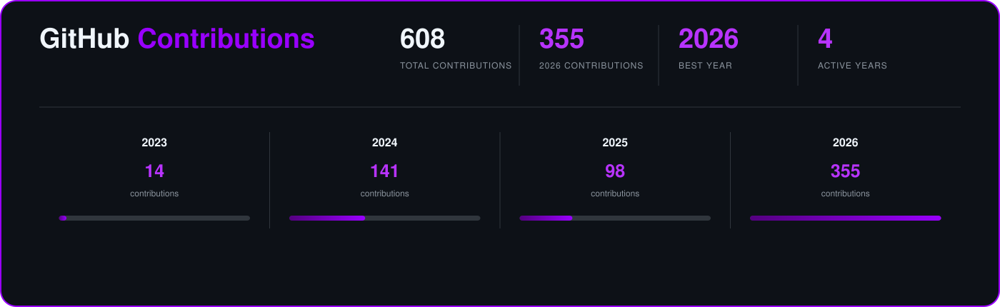

<!-- ========================= -->
<!--          HEADER           -->
<!-- ========================= -->

# 👋 Hi, I'm Dennys

### Systems Engineer • Web Developer • Data Analyst

---

<!-- ========================= -->
<!--        ABOUT ME           -->
<!-- ========================= -->

## 🟣 About Me

I'm a **Systems Engineer** focused on building practical technology solutions and working with data.

-  Working on **Web Development**
-  Working with **Data Analytics**
-  Learning **Data Engineering**
  
---

<!-- ========================= -->
<!--        TECH STACK         -->
<!-- ========================= -->

##  Tech Stack

###  Programming Languages

###  Web Development

###  Databases

###  Data & Analytics

###  Cloud & Deployment

###  Tools & Version Control

---

<!-- ========================= -->
<!--       GITHUB STATS        -->
<!-- ========================= -->

## 📊 GitHub Stats

  

---

<!-- ========================= -->
<!--          FOOTER           -->
<!-- ========================= -->

